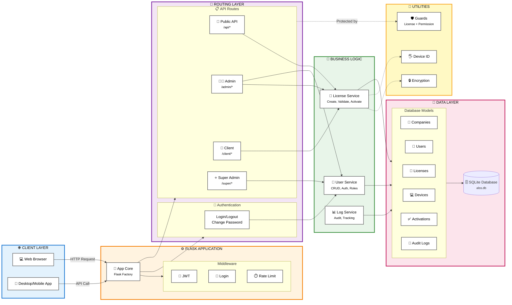

# ALSS (Advanced License Security System) - Architecture Overview

## System Architecture Flowchart

This document provides a comprehensive overview of the ALSS web application architecture, showing how all components interact with each other.



## Component Descriptions

### 1. **Client Layer**
- **Web Browser**: Users access the web interface through browsers
- **Client Application**: Desktop/mobile applications that interact with the API

### 2. **Frontend Layer**
- **HTML Templates**: Jinja2 templates for rendering web pages
- **Static Assets**: CSS, JavaScript, and image files

### 3. **Flask Application Core**
- **app.py**: Main application factory and configuration
- **Middleware**: JWT authentication, session management, rate limiting, and database migrations

### 4. **Authentication Layer**
- **Auth Routes**: Handle login, logout, and password changes
- **JWT Handler**: Token generation and validation
- **Token Service**: Token lifecycle management
- **Guards**: License and permission-based access control

### 5. **Route Blueprints**
- **API Routes** (`/api`): External API for client applications
- **Admin Routes** (`/admin`): Company admin dashboard and management
- **Client Routes** (`/client`): Client user interface
- **Super Admin Routes** (`/super`): System-wide administration
- **Log Routes**: Audit log viewing

### 6. **Business Logic Layer (Services)**
- **License Service**: License creation, validation, activation, and device management
- **User Service**: User CRUD operations and authentication
- **Log Service**: Audit logging and activity tracking

### 7. **Utility Layer**
- **Crypto**: Encryption/decryption for sensitive data
- **Fingerprint**: Device identification
- **Audit**: Audit log creation
- **Time Utils**: Timezone conversion (UTC to IST)
- **CSV Export**: Data export functionality
- **Enforcement**: License validation logic

### 8. **Database Layer**
- **SQLAlchemy ORM**: Database abstraction layer
- **Database Tables**:
  - `companies`: Company/organization records
  - `users`: User accounts with roles (SUPER_ADMIN, COMPANY_ADMIN, COMPANY_VIEWER)
  - `licenses`: License keys (encrypted) with expiration and device limits
  - `devices`: Device fingerprints and metadata
  - `activations`: License-device associations
  - `audit_logs`: System activity tracking
  - `token_blocklist`: Revoked JWT tokens

### 9. **Configuration Layer**
- **config.py**: Application configuration
- **.env**: Environment variables
- **logging_config.py**: Logging setup

### 10. **File Storage**
- **SQLite Database**: `database/alss.db`
- **Log Files**: Application logs in `logs/` directory

## Data Flow Examples

### User Login Flow
1. User submits credentials via browser → `AuthRoutes`
2. `AuthRoutes` → `UserService` (validate credentials)
3. `UserService` → `Models` → `users` table (query user)
4. `JWTHandler` generates access/refresh tokens
5. Tokens returned to browser, stored in localStorage
6. Subsequent requests include JWT in Authorization header

### License Activation Flow
1. Client app sends activation request → `APIRoutes`
2. `Decorators` validate JWT token
3. `LicenseService` validates license key
4. `Fingerprint` generates device ID
5. `LicenseService` checks device limits
6. Creates `Activation` record linking license and device
7. `Audit` logs the activation event
8. Success/failure response returned to client

### Admin License Management Flow
1. Admin accesses dashboard → `AdminRoutes`
2. `Decorators` check role permissions
3. `AdminRoutes` → `LicenseService` (fetch licenses)
4. `LicenseService` → `Models` → `licenses` table
5. `Crypto` decrypts license keys for display
6. Data rendered in `Templates` → Browser

## Security Features

- **JWT Authentication**: Short-lived access tokens (10 min) with refresh tokens (14 days)
- **Role-Based Access Control**: SUPER_ADMIN, COMPANY_ADMIN, COMPANY_VIEWER
- **License Encryption**: License keys encrypted at rest using Fernet
- **Rate Limiting**: API protection based on license key + device fingerprint
- **Audit Logging**: All critical actions logged with IP and user agent
- **Token Revocation**: Blocklist for invalidated tokens
- **Security Headers**: X-Content-Type-Options, X-Frame-Options, Referrer-Policy

## Technology Stack

- **Backend Framework**: Flask (Python)
- **Database**: SQLAlchemy ORM with SQLite
- **Authentication**: Flask-Login (sessions) + Flask-JWT-Extended (API tokens)
- **Security**: Cryptography (Fernet), Werkzeug password hashing
- **Rate Limiting**: Flask-Limiter
- **Frontend**: Jinja2 templates, vanilla JavaScript
- **Database Migrations**: Flask-Migrate (Alembic)

## User Roles

1. **SUPER_ADMIN**: System-wide access, manages all companies and users
2. **COMPANY_ADMIN**: Company-level access, manages licenses, devices, and company users
3. **COMPANY_VIEWER**: Read-only access to company resources

## API Endpoints

### Authentication
- `POST /auth/login` - User login
- `POST /auth/logout` - User logout
- `POST /auth/change-password` - Password change

### Public API (for client applications)
- `POST /api/activate` - Activate license on device
- `POST /api/heartbeat` - Device heartbeat/status update
- `POST /api/validate` - Validate license status

### Admin API
- `/admin/dashboard` - Admin dashboard
- `/admin/api/licenses` - License management
- `/admin/api/devices` - Device management
- `/admin/api/users` - User management

### Super Admin API
- `/super/dashboard` - Super admin dashboard
- `/super/api/companies` - Company management
- `/super/api/users` - Global user management

## Database Schema Relationships

```
companies (1) ──< (N) users
companies (1) ──< (N) licenses
users (1) ──< (N) licenses (as vendor)
licenses (1) ──< (N) activations
devices (1) ──< (N) activations
users (1) ──< (N) audit_logs
licenses (1) ──< (N) audit_logs
```

## Key Features

1. **Multi-tenant Architecture**: Support for multiple companies
2. **Device Fingerprinting**: Unique device identification
3. **License Activation Limits**: Enforce max device limits per license
4. **License Expiration**: Time-based license validity
5. **Audit Trail**: Complete activity logging
6. **CSV Export**: Export data for reporting
7. **Heartbeat Monitoring**: Track active devices
8. **Token Management**: Secure token lifecycle with revocation
